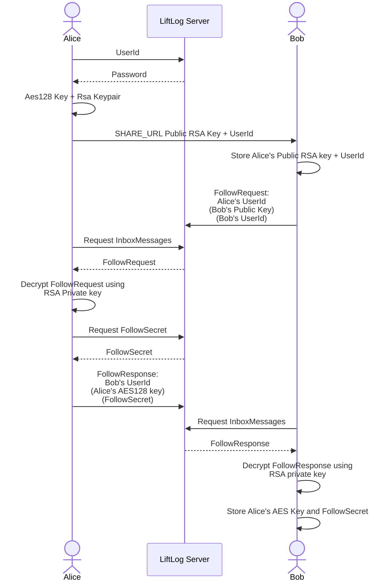
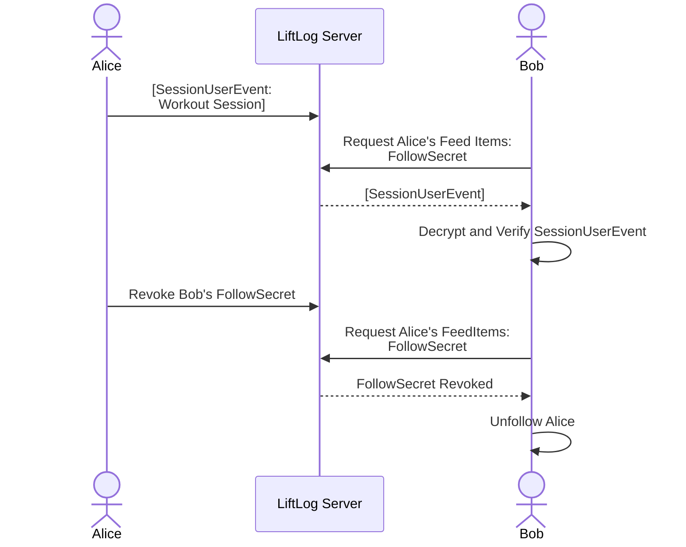

# Feed Process

LiftLog gives users the option of publishing their workouts to a feed which they can share with other users. This sharing allows users to subscribe to a user's feed and see their workouts, plan, and other items. This is entirely opt in.

Privacy is extremely important to preserve here, data is end to end encrypted ([see Technical Details](#technical-details)), and users are in full control of who can view their feed. Users must request access to another user's feed, which they can do by using a URL generated by the original user. For example:

1. Bob opts in to publishing to the feed and gets his `SHARE_URL`
2. `Bob` sends his `SHARE_URL` to `Alice`
3. After clicking the `SHARE_URL`, `Alice` sends a request asking to follow `Bob`'s feed
4. `Bob` opens his app, sees that `Alice` is requesting to follow him, and can either accept or reject this request.
5. If `Bob` accepts, `Alice` will begin seeing `Bob`'s feed information. `Bob` is **not** subscribed to `Alice`'s feed.

Note, users are free to provide any name they like, so they should be cautious when accepting feed requests. As mentioned in the example, following is a one way operation. Users can see who is following them, but this does not mean that they are also following that user.

## Technical Details

As mentioned, personal information (including workouts) is end to end encrypted.
Personal Information that is NOT encrypted is limited to:

- Timestamp of request - this is the timestamp of when a feed item was submitted. This could correlate to a time of workout, and therefore could be considered PII.
- User ID (a UUID) - this is stored on the device, but is not linked to it (i.e. The LiftLog servers cannot trace userId to device)

Data is encrypted by the user before sending to the LiftLog server. It is encrypted via AES-CBC, and signed via RSA-PSS to guarantee authenticity (see [Payload Encryption](#payload-encryption)). At no point does the server store the unencrypted keys, not even public RSA keys (caveat, the public key is supplied as a query parameter, which the server could see. However it is not stored, nor does it reach the API server, merely the CDN).

### How following is accomplished

As mentioned, interacting with a feed is opt in. To opt in, a user will generate an identity, which is stored on THEIR device. An identity consists of:

- An optional name
- An optional profile picture
- An Aes128 Key
- An RSA Key pair (2048 key size)
- A User ID (UUID)

The client will register their identity with the LiftLog servers by sending ONLY their UserId to the createUser endpoint. If a user does not already exist with that ID the server will generate a random `Password`, and send that `Password` back to the client. The `Password` is salted and hashed then stored against the user's ID on the server. This `Password` must be provided when publishing any data for that `UserId` to the server.

Using this identity, the client can create a `SHARE_URL`. This url consists of 3 unique parts from the identity:

- UserId
- Name (still optional)
- RSA Public key in Spki format

An example share url could look like this (note this is non functional):

```
https://app.liftlog.online/feed/share?pub=30820122300D06092A864886F70D01010105000382010F003082010A0282010100C4F7583802DB987F9C27242D598986818C89A47E40D5C3E51F0DE49EDDAFB43D11C00D9A05BC409E67B507684D0DAE47DB38BEFE8C94D6D4DD9A5BEEAD7C970ED3F2824467D82362521CC24B8D7AF64D9E3A39E258E8DE0941F980B8BFE41A019BDE2A78A93F917A94C82E6DA78F432B9C9429CBADF7892A66313F16D9928F03D1937DA1ACA9C668ECB2D48042F05FC384CB315E78EF75BA705639A8C6464A586191B62E717C3F3E6009C7E92958428F5160D733DC3254E34C94AE90F4A77BE75D6558DB042616527BF9ED47177C45E48A93EBE30D2080CB0D9D5A1E7F996D6B7520FD1FC5FECBA51F3842AAB486C2539521C8CE2663DB35E3084176643B1BBF0203010001&id=95e80409-dd6e-4cdb-b382-fb85b154350f&name=Liam
```

The structure of the url being:
`https://app.liftlog.online/feed/share?pub=HEX_ENCODED_PUBLIC_KEY_SPKI&id=USER_ID&name=Name`

When a user (the follower) clicks this link, it will open directly in the LiftLog app, or in the web app. The app parses out the three parameters and displays a message asking if they would like to request to subscribe to the feed. Note the follower must also have an identity setup prior to making the request. If they accept they create an `InboxMessage` (of type `FollowRequest`) payload consisting of:

- The follower's RSA Public Key
- An optional name
- The follower's user ID

This `InboxMessage` is chunked and encrypted with the original user's `Public RSA Key` (see [Inbox Message Encryption](#inbox-message-encryption)). The encrypted chunks are then posted to the LiftLog server, along with the original user's UserId (unencrypted).

The original user queries the LiftLog server for any inbox messages, and receives the encrypted payload. They decrypt this payload using their RSA private key. The user is displayed a message that the follower user wants to follow them.

Upon accepting this request, the original User requests a new `FollowSecret` from the LiftLog server. This `FollowSecret` is generated by the server, and acts as a sort of API key, which will allow the follower to request the original user's **encrypted** feed items. These can be revoked by the original user at any time, which will cause the follower to unfollow.

The original user then generates an `InboxMessage` (of type `FollowResponse`) consisting of:

- Their AES128 key
- The Follow Secret
- Their User Id (all `InboxMessage` include this)

This payload is encrypted with the `follower's` Public RSA Key they received in the original `FollowRequest`. It is sent to the follower's inbox.

When the follower opens their app, the app will query for their inbox messages and receive this `FollowResponse`. The follower will decrypt the payload using their RSA public key, and persist the follow secret and the original user's AES128 Key. The follower is successfully following the original user! They can now request the original user's feed items (with the follow secret), and decrypt them with the original user's AES128 key.

A flow chart demonstrating this process is below.
Note items in (are encrypted with RSA public key):



### Publishing and Requesting Feed Items

As mentioned earlier, each user has an identity which contains both an AES128 key and an RSA Keypair, their user Id, and a Password. All of these items are required to publish feed items. A user's workout sessions are a type of feed item.
When a user completes a workout, they create a `SessionUserEvent` payload consisting of that session's data. This payload is signed with their RSA private key then that payload and the signature is encrypted with their AES key (see [Payload Encryption](#payload-encryption)).

This encrypted payload is then sent to the LiftLog server as a Feed Item, and is stored encrypted at rest against their UserId.

When a follower requests feed items for this user (if their FollowSecret is still valid), it is returned to them in this encrypted and signed form. They use the previously exchanged AES key to decrypt the payload, then verify the decrypted payload's signature with the exchanged RSA public key. If it is valid, it is displayed in their feed.

A flow chart demonstrating this process is below.
Note items in [are encrypted via AES and signed via RSA].



### Inbox Message Encryption

Inbox messages are aimed to be small messages which can be encoded and sent to a user with their RSA Public key.
Since RSA has a rather small max paylaod length, these messages are split into chunks, then each chunk is encrypted. These chunks are then sent to the server. When a user requests their inbox messages, they are returned, then immediately deleted from the server. The user can use their private key to decrypt the chunks, then stitch them back together to form the original payload.

### Payload Encryption

As mentioned, Feed Item payloads are first signed, then encrypted with AES-CBC. AES-CBC makes no guarantees about the authenticity of encrypted payloads, and as such it is possible (however of extremely small risk in liftlog's case) for an attacker to modify messages without the original key assuming they know some constant part of the unencrypted payload. This is described well by [this post by Seald](https://www.seald.io/blog/3-common-mistakes-when-implementing-encryption), of which LiftLog has no affiliation.

Why not use AES-GCM, which DOES provide authenticity of messages? Simply because it was not available at the time of writing on iOS. This is tracked here https://github.com/dotnet/runtime/issues/94848. We may revisit this when it becomes available.

The method for providing authenticity of encrypted payloads is as such:

1. The SHA256 hash of the unencrypted payload is calculated - Creating the PayloadHash
2. A signature of the PayloadHash is generated with the RSA private key
3. This signature is appended to the end of the encrypted payload - creating the SignedPayload
4. The SignedPayload is then encrypted with AES-CBC - creating the EncryptedSignedPayload

On decryption:

1. The EncryptedSignedPayload is decrypted with AES-CBC - Creating the SignedPayload
2. The last 256 bytes of the SignedPayload are split off - Creating the UnverifiedPayload and the Signature
3. The SHA256 hash of the UnverifiedPayload is calculated - Creating the UnverifiedPayloadHash (which should be identical to the original PayloadHash)
4. The Signature is verified using the PublicKey and the UnverifiedPayloadHash
5. If the signature is valid, then the payload is valid

If an attacker was to attempt to create a modified payload, upon decryption a different SHA256 hash would be generated, which the signature would not be valid for - therefore invalidating the poisone message.
