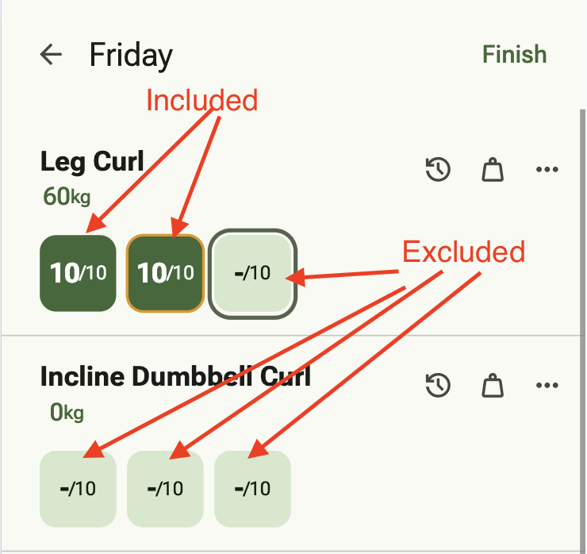

# Plaintext Export

LiftLog supports exporting your data as plaintext. Currently it supports CSV files.
These exports must NOT be used as a backup mechanism, as LiftLog cannot read these CSVs.

To create an export, simply navigate to `Settings -> Export, Backup, and Restore -> Plaintext Export`.
Here, you can export a CSV file which contains your workout data. Sets which have not been completed are not included in the export.


An example of the produced CSV:

```csv
SessionId,Timestamp,Exercise,Weight,WeightUnit,Reps,TargetReps,Notes
b59ab47f-8955-4a23-afa3-5d472dacc575,2024-10-16T10:45:06,Incline Dumbbell Bench Press,60,kg,8,8,
8b929966-2426-4cbf-b678-ac8e811c8b2b,2024-10-16T10:44:39,Bench Press,67.5,kg,12,12,
8b929966-2426-4cbf-b678-ac8e811c8b2b,2024-10-16T10:44:38,Bench Press,67.5,kg,12,12,
8b929966-2426-4cbf-b678-ac8e811c8b2b,2024-10-16T10:44:38,Bench Press,67.5,kg,12,12,
95bf84cb-1f11-4d51-ba6e-a4c3f1e40b08,2024-10-16T10:43:50,Pull-ups,84,kg,8,8,
95bf84cb-1f11-4d51-ba6e-a4c3f1e40b08,2024-10-16T10:43:50,Pull-ups,84,kg,7,8,
9c67f65a-3099-4d6b-b04d-428ce386f61d,2024-10-16T10:43:41,Squats,97.5,kg,8,8,
9c67f65a-3099-4d6b-b04d-428ce386f61d,2024-10-16T10:43:41,Squats,97.5,kg,8,8,
```
