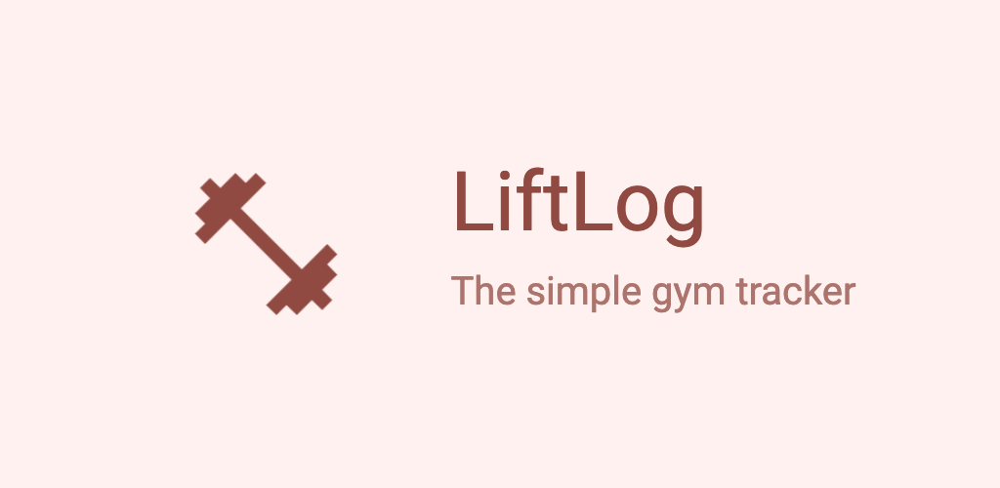

# LiftLog

<p align="center">
  <br/>
  
  
  
</p>

<p align="center">
  <a href='https://play.google.com/store/apps/details?id=com.limajuice.liftlog&pcampaignid=pcampaignidMKT-Other-global-all-co-prtnr-py-PartBadge-Mar2515-1'></a>
  <a href="https://apps.apple.com/au/app/liftlog/id6467372581?itsct=apps_box_badge&amp;itscg=30200"></a>
  <a href='https://app.liftlog.online'></a>
</p>

---

## 🚀 Overview

**LiftLog** is an intuitive, cross-platform gym weight tracking app built with React Native and Expo. It features Material Design 3, AI-powered workout planning, and secure, end-to-end encrypted social feeds. Available on Android, iOS, and the web.

### Key Features

- 📱 Runs on Android, iOS, and web
- 🧠 AI planner tailors gym plans to your goals and body
- 🔒 End-to-end encrypted social feeds (opt-in, privacy-first)
- 🎨 Material Design 3 via React Native Paper
- 🌐 Internationalization with Tolgee/Weblate (10+ languages)
- 🏋️‍♂️ Publish workouts, follow other users, and control your feed privacy
- ⚡ Fast, modern UI with Expo Router and Redux Toolkit

📍 **[View the Roadmap](./ROADMAP.md)** to see what's planned!

---

## 🌍 Translations

LiftLog uses [Weblate](https://translate.liftlog.online/) for internationalization and translation management. Anyone can create an account and start translating!

[](https://translate.liftlog.online/engage/liftlog/)

Want to help translate? [Create an account on Weblate!](https://translate.liftlog.online/)

---

## ⚡ Quickstart

### Prerequisites

1. **Node.js** (v18+): [Download here](https://nodejs.org/)
2. **Expo CLI**: `npm install -g expo-cli` ([Guide](https://docs.expo.dev/get-started/set-up-your-environment/))
3. **Android Studio** (for Android) ([Setup](https://reactnative.dev/docs/environment-setup))
4. **Xcode** (for iOS, macOS only) ([Setup](https://reactnative.dev/docs/environment-setup?os=macos&platform=ios))

### Run the App

```bash
cd app
npm install
npm run android   # For Android
npm run ios       # For iOS (macOS only)
npm run web       # For web
```

### Run the Backend API

See [`backend/README.md`](./backend/README.md) for more information on running the backend.

---

## 🗂️ Project Structure

LiftLog is organized into several projects:

### Frontend ([app/](./app/))

- **Main React Native app** (Expo)
- **Components**: `components/` (layout, presentation, smart)
- **State**: `store/` (Redux Toolkit)
- **Services**: `services/` (API, business logic)
- **Hooks**: `hooks/` (custom React hooks)
- **Translations**: `i18n/` (Tolgee)
- **Navigation**: Expo Router

### Backend ([LiftLog.Api/](./backend/))

For documentation on running the backend for local development, see [the README](./backend/README.md)

- **Dotnet WebAPI** for feeds, AI plans, and secure data
- **End-to-end encrypted feeds** (AES)
- **OpenAI integration** for workout plans

### RevenueCat ([RevenueCat/](./backend/RevenueCat/))

- **Client library** for in-app purchases/subscriptions

### Website ([site/](./site))

- **Source for liftlog.online** and privacy policy

---

## 📊 Stats

<a href="https://www.star-history.com/#LiamMorrow/LiftLog&Date">
 <picture>
   <source media="(prefers-color-scheme: dark)" srcset="https://api.star-history.com/svg?repos=LiamMorrow/LiftLog&type=Date&theme=dark" />
   <source media="(prefers-color-scheme: light)" srcset="https://api.star-history.com/svg?repos=LiamMorrow/LiftLog&type=Date" />
   
 </picture>
</a>

---

## 🤝 Contributing

Contributions, issues, and feature requests are welcome! See [CONTRIBUTING.md](./CONTRIBUTING.md) (or open an issue/PR).

## 📚 Documentation

- [Feed Process](./docs/FeedProcess.md)
- [Remote Backup](./docs/RemoteBackup.md)
- [Plaintext Export](./docs/PlaintextExport.md)

## 💬 Support & Community

- [Discord](https://discord.gg/YHhKEnEnFa)
- [App Website](https://liftlog.online)
- [Try Demo](https://app.liftlog.online)

---

> **Note:** LiftLog was rewritten from the ground up in React Native. The previous .NET MAUI Blazor implementation is in the `dotnet` branch.
